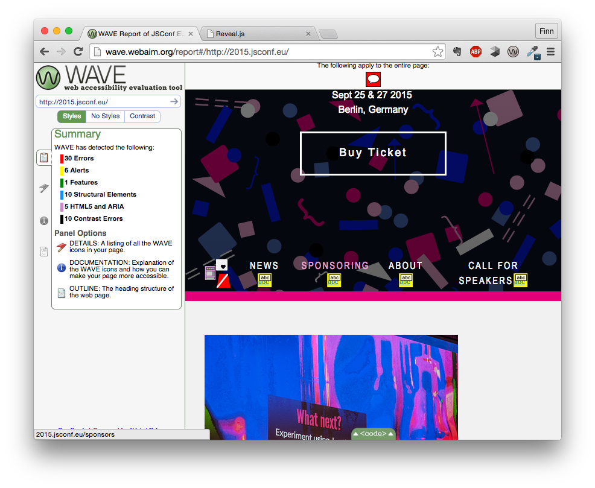

# With accessibility in mind

---

## Why?

> “There are only disabled and temporary non-disabled people”

Raul Krauthausen @raulde

<small>Also: It's our obligation to make the web accessible, sometimes even legally</small>

---

## JavaScript?!
- **97,6%** of people with screen readers use it
- therefore `<noscript>` is not valuable to screen readers
- Don't surprise people though

<small>Source: http://a11yproject.com/posts/myth-screen-readers-dont-use-javascript/</small>

---

## Key categories

- **Visual**
- Auditory
- Motor
- Cognitive

<small>More at: http://a11yproject.com/posts/myth-accessibility-is-blind-people/</small>

---

## Standards

- [Web Content Accessibility Guidelines (WCAG) 2.0](http://www.w3.org/TR/WCAG20/)
  - General guidelines for web pages
  - Different levels A, AA, AAA
- [Accessible Rich Internet Applications (WAI-ARIA) 1.0](http://www.w3.org/TR/wai-aria/)
  - Newer W3C Recommendation for rich semantic informations 
  - e.g. `role="navigation"`

---

> “A11y often gets narrowed down to a document, a standard, but no, it’s about creating an **experience for people**”

Saqib Shaikh @saqibs

---

## What you can implement

---

### ARIA landmarks

- navigation
- main
- banner
- search
- complementary
- form
- contentinfo
- application (use this sparingly)

---

### Meaningful Heading outline

- It matters how you structure heading elements
- Don't use heading elements for styling
- Should look like a table of contents

---

### Skip to content

- Skipping long navigation items
- `require('tab-navigation-fix')()`
- http://npm.im/tab-navigation-fix

---

## Tools

---

### WAVE

- Checks common accessibility errors based on WCAG
- Available as extension for firefox and chrome
- http://wave.webaim.org/

---

---

### Getting started with VoiceOver

Let's use VoiceOver.

- Start: ⌘-F5
- Navigational commands with control option (VO)
- Use Safari (best supported)
- Help: VO-H
- Web item rotor: VO-U

http://a11yproject.com/posts/getting-started-with-voiceover/
